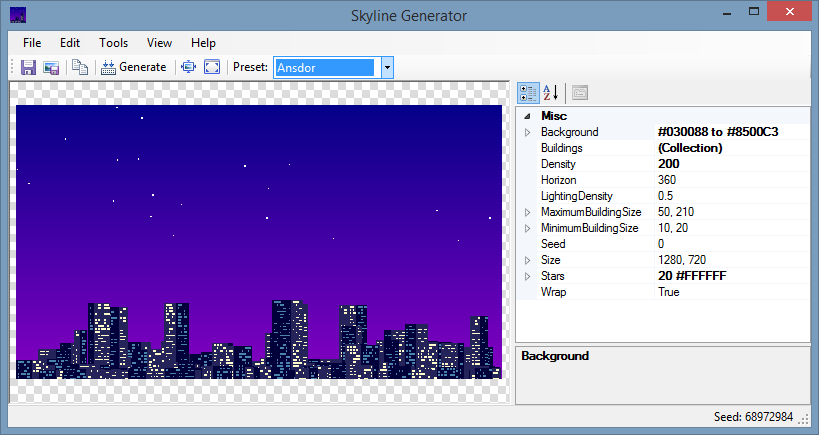

Skyline Generator
=================

I wanted a background image, and I'd decided I wanted a 8bit style skyline (similar to [QBasic Gorillas](http://en.wikipedia.org/wiki/Gorillas_(video_game)). I found a lot of nice images on Bing image search, but none of them were public domain that I could see - and as I'd be distributing the image, I had to be assured there would be no complications.

Inspiration
-----------

On [Ansdor's Pixel Lounge](http://www.ansdor.com) I found a [nice looking](http://www.ansdor.com/post/105913561346) skyline and of course had to drop everything to write a skyline generator. It produces a result close enough to what I wanted so will do for now. 

Limitations
-----------

I only spent a couple of hours on this as it is just a diversion from what I'm supposed to be doing! So it's rough and ready as with most of my experimental programs. No validation checking so expect it to crash if you enter wrong values.

It's not really a true 8bit style as the gradient background isn't dithered but I can't think how to do that.

I also wanted to add different building shapes but again... quick program.

In Ansdor's example, I think he uses two tones as a sort of 3D effect, whereas I'm just drawing flat 2D blocks in the different colors. I also was thinking about layering and some sort of normal distribution but this is way overboard for a program I'm likely to use exactly once.

Samples
-------

